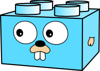

# evb provides EVB-specific functions for the Go ev3dev interface

[](https://travis-ci.org/ev3go/evb) [](https://coveralls.io/github/ev3go/evb?branch=master) [](https://godoc.org/github.com/ev3go/evb)
[](https://app.fossa.com/projects/git%2Bgithub.com%2Fev3go%2Fevb?ref=badge_shield)

github.com/ev3go/evb depends on an ev3dev kernel 4.4.9-ti-rt-r25-11-ev3dev-bb.org or better.

## Example code

```
package main

import (
	"image"
	"image/draw"
	"time"

	"github.com/ev3go/ev3dev/fb"
	"github.com/ev3go/evb"
)

func main() {
	evb.LCD.Init(true)
	defer evb.LCD.Close()

	// Render the gopherbrick to the screen.
	draw.Draw(evb.LCD, evb.LCD.Bounds(), gopher, gopher.Bounds().Min, draw.Src)

	time.Sleep(10 * time.Second)
}

var gopher = &fb.RGB565{
	Pix: []uint8{
		<snip image data bytes>
	},
	Stride: 440,
	Rect: image.Rectangle{
		Min: image.Point{
			X: 0,
			Y: 0,
		},
		Max: image.Point{
			X: 220,
			Y: 176,
		},
	},
}
```


## License
[](https://app.fossa.com/projects/git%2Bgithub.com%2Fev3go%2Fevb?ref=badge_large)